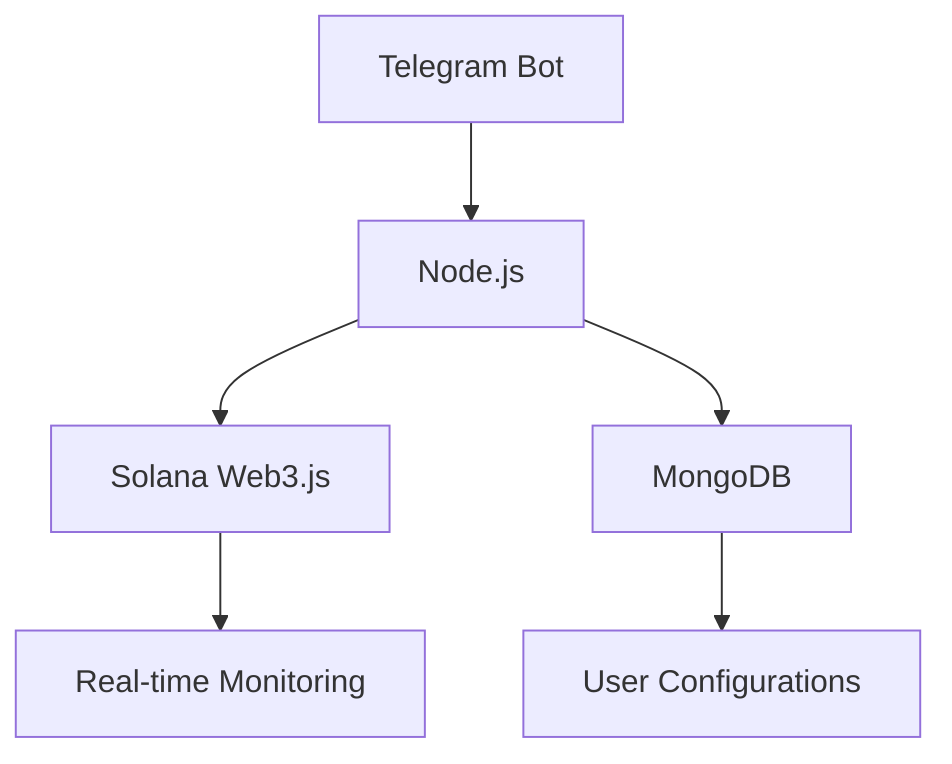

# Solana Telegram Copy Trading Bot

A sophisticated Telegram bot for automated copy trading on the Solana blockchain, featuring multi-wallet management and real-time monitoring.

## Key Features ✨
- 🛡️ Secure Solana wallet integration (Base58 keypair)
- 📊 Real-time balance tracking with SOL/USD conversion
- 🎯 Multi-target wallet management system
- ⚙️ Granular trading parameters:
  - Buy percentage allocation (1-100%)
  - Slippage tolerance (0-100%)
  - Gas fee customization
  - Market cap filters
  - Transaction retry logic
- 🚦 Risk management controls:
  - Minimum/maximum buy thresholds
  - Token blacklisting
  - Transaction limits
- 📈 Performance tracking with PNL/ROI metrics

## Tech Stack 🛠️


## Installation 📥
```bash
git clone https://github.com/terter21002/copy-trading-bot.git
copy-trading-bot
npm install
```

## Configuration ⚙️
1. Create `.env` file:
```ini
SHYFT_API_KEY = ""
SHYFT_RPC_URL = ""
SHYFT_RPC_CONFIG_URL = ""
JITO_RPC_URL = ""
JUP_SWAP_URL = ""
mongoURI = ""
```


2. Database setup:
```bash
mongod --dbpath ./data/db
```

## Usage Guide 📖
1. Start the bot:
```bash
npm start
```

2. Telegram commands:
| Command | Description |
|---------|-------------|
| `/start` | Initialize bot session |
| `/stop` | Terminate trading operations |
| Wallet Setup | Connect via inline keyboard |
| Trade Config | Configure through interactive menus |

## Security Notes 🔒
- Private keys encrypted using Base58 encoding
- Session management with message purging
- Database isolation for user configurations
- **Warning:** Never share your private key through unsecured channels

## Roadmap 🗺️
- [ ] Cross-chain compatibility
- [ ] DEX integration (Raydium, Orca)
- [ ] Machine learning-based trade prediction
- [ ] Multi-language support

## Disclaimer ⚠️
```bash
THIS SOFTWARE IS PROVIDED "AS IS" WITHOUT WARRANTY OF ANY KIND.
Cryptocurrency trading involves substantial risk. Always conduct
thorough testing with small amounts before live deployment.
```

## Contact 📬
For support, feature requests, or collaboration inquiries, contact us via Telegram:  
**[@terter21002](https://t.me/terter21002)**
